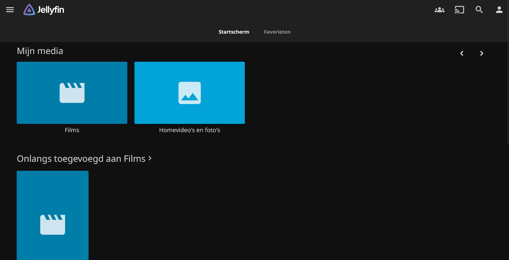

# Testplan Jellyfin

- Auteur(s) testplan: Gilles De Meerleer

## Test: Jellyfin is correct geïnstalleerd

Testprocedure:

1. surf naar `http://192.168.207.53:8096`
2. Je krijgt een wizard te zien om de server in te stellen.
3. Als je alle stappen doorloopt, krijg je een melding dat de server is ingesteld.
4. Je kan nu inloggen met de gebruikersnaam en het wachtwoord dat je hebt ingesteld.
5. Eens ingelogd kan je de bibliotheken configureren waarna je alle video's en foto's kan bekijken.

Verwacht resultaat:

- Je kan de video's afspelen die in de bibliotheek staan.
- Je kan de instellingen van de server bekijken en aanpassen.
- Je kan de foto's bekijken die in de bibliotheek staan.

