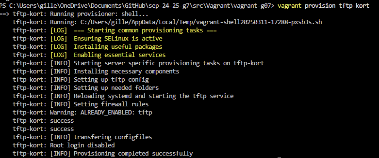
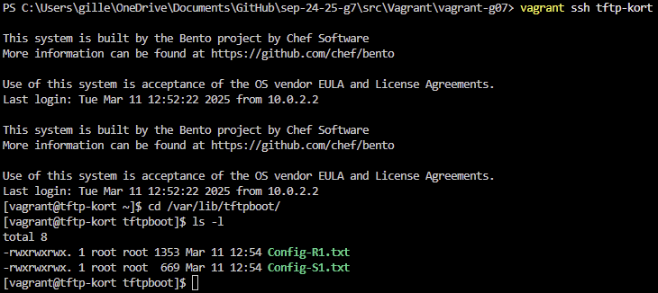

# Testplan

- Auteur testplan: Gilles De Meerleer

## Test: Netwerkverbinding VM testen

Testprocedure:

1. Voer in powershell `vagrant up tftp` uit
2. Wacht tot volledige installatie is voltooid
3. `ping 192.168.207.33`

Verwacht resultaat:

- VM start op zonder error's te geven
- De VM is raadpleegbaar via ingesteld ip addres




## Test: Inhoud controleren van TFTP files voor config Routers en Switches

Testprocedure:

1. Verbind via `vagrant ssh tftp` naar de VM
2. Navigeer naar de TFTP root directory `cd /var/lib/tftpboot`
3. Kijk met `ls` of de files `Config-R1.txt` en `Config-S1.txt` aanwezig zijn

Verwacht resultaat:

- Er zijn 2 files zichtbaar die de configuratie van de Switch en Router bevatten



## Test of de TFTP server werkt

Voer het volgende commando uit in de VM:

```bash
tftp localhost
get Config-R1.txt
ls
```

Verwacht resultaat:

Je ziet het bestand `Config-R1.txt` verschijnen in de home directory van de gebruiker die je gebruikt om in te loggen op de VM.

## Test of de TFTP server bereikbaar is vanop de router

Voer het volgende commando uit in de router:

```bash
ping 192.168.207.59
```

Verwacht resultaat:

Je krijgt een reply van de TFTP server.
