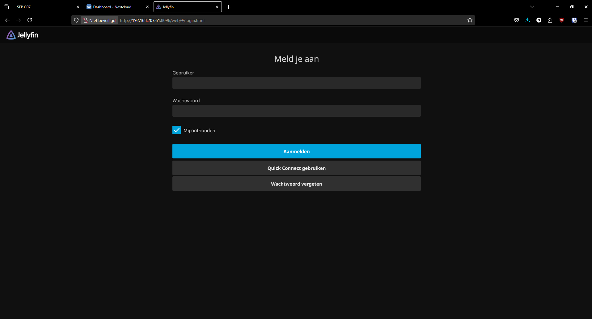
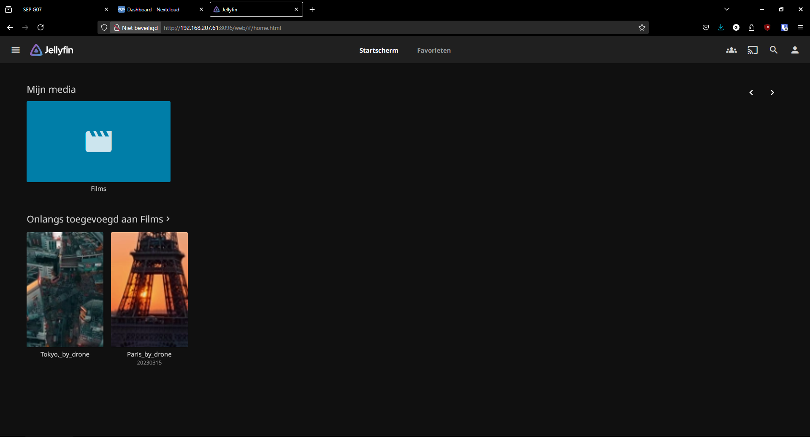
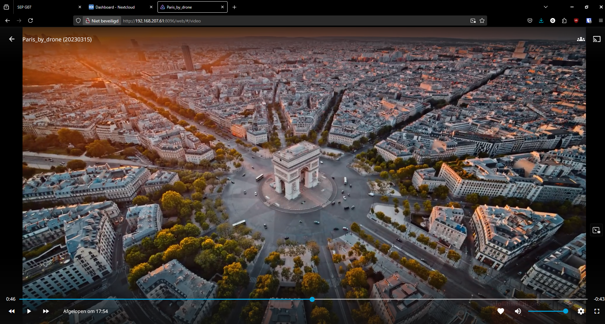

# Testrapport

- Uitvoerder(s) test: Matthias Schoubben
- Uitgevoerd op: 14/05/2025
- Github commit: <!-- Git commit hash. -->

## Test: Jellyfin installeren en testen

Test procedure:

1. surf naar `http://192.168.207.53:8096`
2. Je krijgt een wizard te zien om de server in te stellen.
3. Als je alle stappen doorloopt, krijg je een melding dat de server is ingesteld.
4. Je kan nu inloggen met de gebruikersnaam en het wachtwoord dat je hebt ingesteld.
5. Eens ingelogd kan je de bibliotheken configureren waarna je alle video's en foto's kan bekijken.

Verkregen resultaat:

De server is correct geprovisioned en de installer is te zien:

Het inlogscherm is zichtbaar en de login werkt:

De bibliotheek is zichtbaar en de video's zijn te bekijken:

De video is zichtbaar en kan afgespeeld worden:

<!-- Voeg hier eventueel een screenshot van het verkregen resultaat in. -->

Test geslaagd:

- [x] Ja
- [ ] Nee
