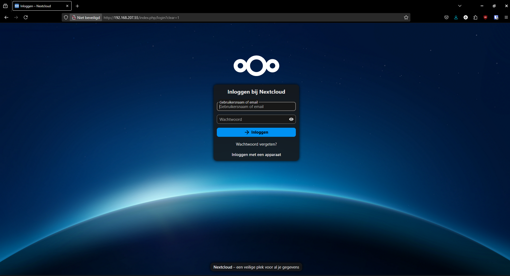
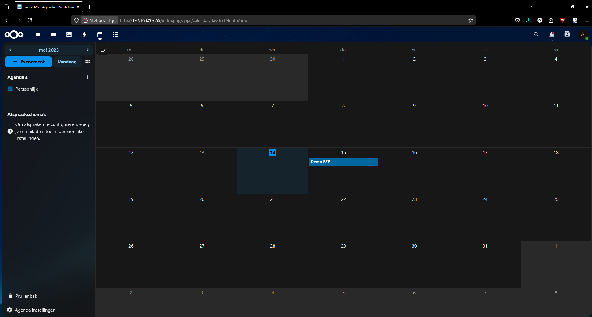
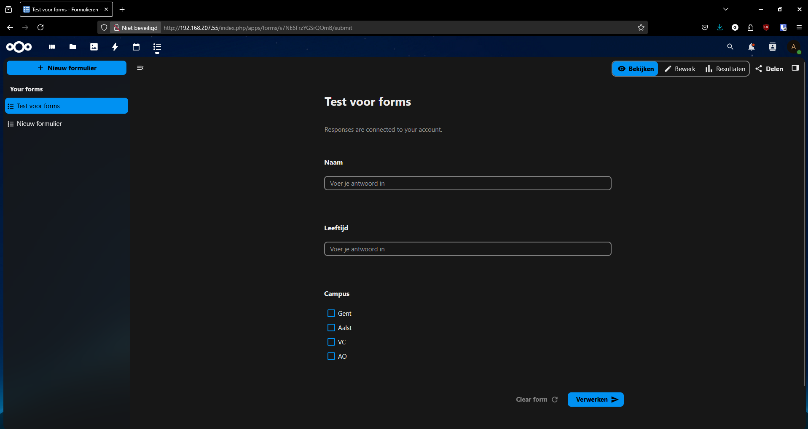

# Testrapport

- Uitvoerder(s) test: Ruben Van Bruyssel
- Uitgevoerd op: 14/05/2025 
- Github commit: <!-- Git commit hash. -->

## Test: Nextcloud installeren en testen

Testprocedure:

1. Run het provisioning script voor Nextcloud.
2. Controleer of de installatie succesvol is door in te loggen op de webinterface van Nextcloud. De login die je moet gebruiken is `admin` met het wachtwoord `admin`.
3. Controleer of de kalender en forms apps zijn geïnstalleerd en geconfigureerd.
4. Maak een item aan in de kalender
5. Maak een formulier aan in de forms app

De admin gebruiker kan zich aanmelden

Er kan een item aangemaakt worden in de agenda:

Er kan een formulier aangemaakt worden in de forms app:

Test geslaagd:

- [X] Ja
- [ ] Nee

