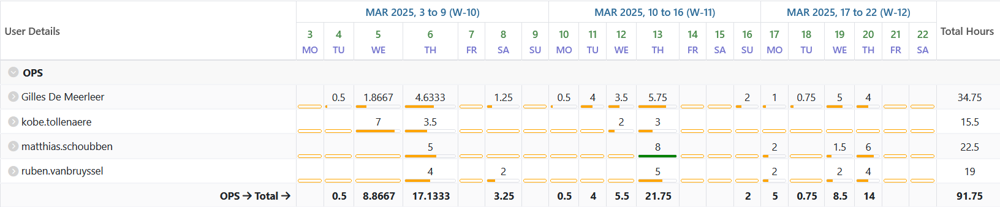
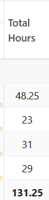
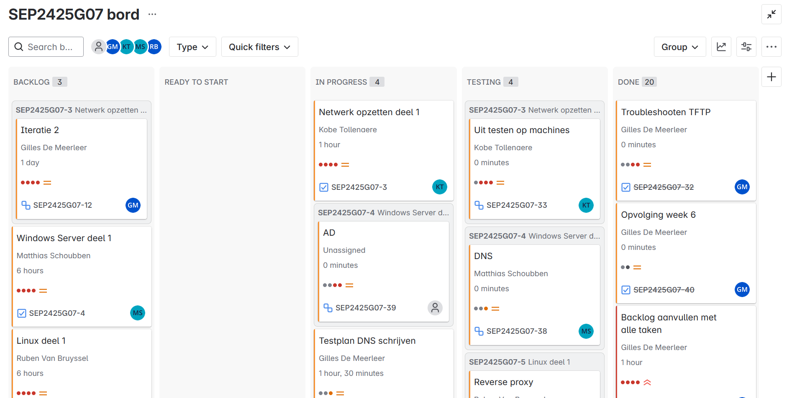
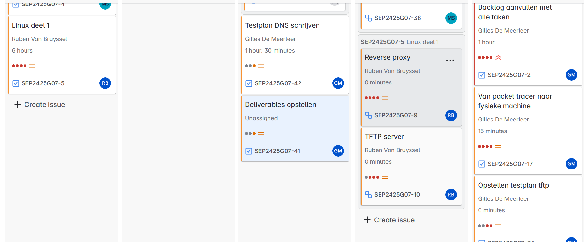
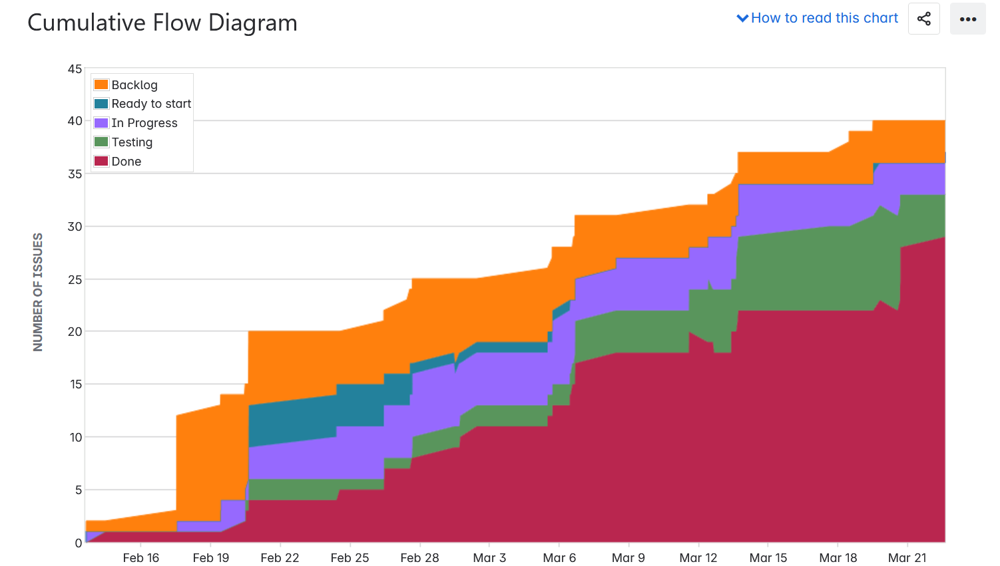
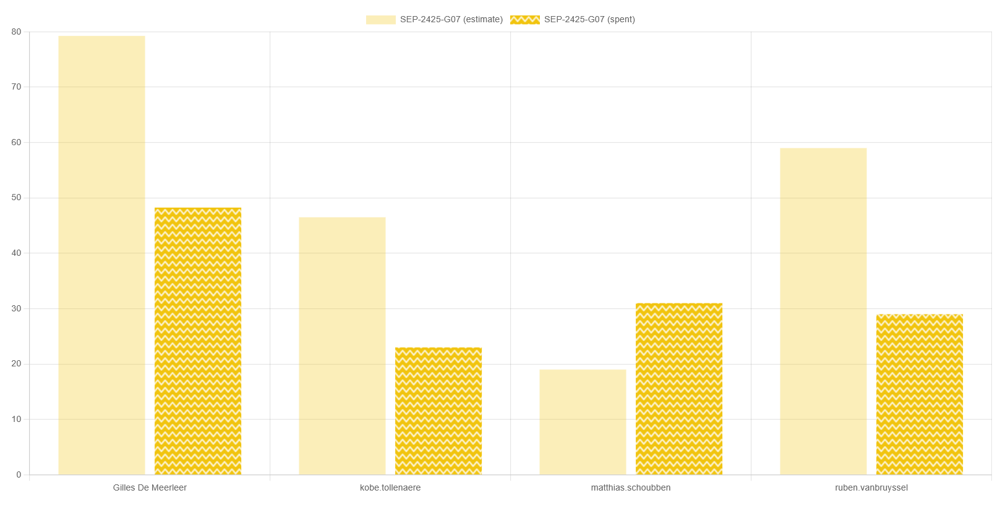

# Deliverables 2 SEP

<!--
  Pas eenmalig dit sjabloon aan met de info van je groep. Daarna kan je wekelijks een kopie maken.

  Indien bepaalde info ook al in JIRA zit, kan je links toevoegen naar de relevante JIRA items ipv hier een copy/paste of screenshot in te voegen.
-->

## Algemeen

- Groep: G07
- Periode: 13 maart 2025 tot 20 maart 2025
- Datum voortgangsgesprek: 2O maart 2025
- JIRA: [Open het bord](https://sep-g07.atlassian.net/jira/software/c/projects/SEP2425G07/boards/2?useStoredSettings=true)

| Student            | Aanw. | Opmerking         |
| :----------------- | :---: | :---------------- |
| Gilles De Meerleer |  ok   |                   |
| Ruben Van Bruyssel |  ok   |                   |
| Matthias Schoubben |  ok   |                   |
| Kobe Tollenaere    |   X   | Gewettigd afwezig |

## Wat heb je deze periode gerealiseerd?

### Algemeen

- Overzicht van de netwerkconfiguratie opgesteld
- Testplannen geschreven
- CMS werkend gekregen
- TFTP server afgewerkt
- Windows script voor AD, DNS en RSAT geschreven
- Netwerk getest op de fysieke apparatuur

### Gilles De Meerleer

<!-- Voeg hier een overzicht toe van gerealiseerde taken inclusief links naar relevante commits/documenten. -->

- CMS werkend gekregen
- TFTP server afgewerkt
- Opvolgingsrapport 5 geschreven
- Netwerk getest op de fysieke apparatuur

### Ruben Van Bruyssel

<!-- Voeg hier een overzicht toe van gerealiseerde taken inclusief links naar relevante commits/documenten. -->

- Reverse proxy opzetten

### Matthias Schoubben

<!-- Voeg hier een overzicht toe van gerealiseerde taken inclusief links naar relevante commits/documenten. -->

- Windows script voor AD, DNS en RSAT geschreven

### Kobe Tollenaere

<!-- Voeg hier een overzicht toe van gerealiseerde taken inclusief links naar relevante commits/documenten. -->

- TFTP server afwerken
- Mattias helpen met Windows client config script maken
- Netwerk getest op de fysieke apparatuur

## Overzicht JIRA

Tijdstabel (laatste 3 weken):

Totale tijdsbesteding van de groep over de gehele periode
(Gilles, Kobe, Matthias en Ruben, Totaal)

Overzicht van het bord:

Cummulative flow diagram:

Estimate vs actual:

## Wat plan je volgende periode te doen?

### Algemeen

<!-- Voeg hier de doelstellingen toe voor volgende periode. -->

- Demo volledig werkend krijgen op de fysieke apparatuur tijdens de voorbereidende momenten
- testplannen schrijven en uitvoeren
- Documentatie schrijven
- Finishing touches aan de Windows server

### Gilles De Meerleer

<!-- Voeg hier de individuele doelstellingen toe voor volgende periode. -->

- Demo volledig werkend krijgen op de fysieke apparatuur tijdens de voorbereidende momenten
- testplannen schrijven en uitvoeren
- Documentatie schrijven

### Ruben Van Bruyssel

<!-- Voeg hier de individuele doelstellingen toe voor volgende periode. -->

- Demo volledig werkend krijgen op de fysieke apparatuur tijdens de voorbereidende momenten
- testplannen schrijven en uitvoeren
- Documentatie schrijven

### Matthias Schoubben

<!-- Voeg hier de individuele doelstellingen toe voor volgende periode. -->

- Finishing touches aan de Windows server
- testplannen schrijven en uitvoeren
- Documentatie schrijven

### Kobe Tollenaere

<!-- Voeg hier de individuele doelstellingen toe voor volgende periode. -->

- Demo volledig werkend krijgen op de fysieke apparatuur tijdens de voorbereidende momenten
- testplannen schrijven en uitvoeren
- Documentatie schrijven
- Finishing touches aan de Windows server

## Retrospectieve

### Wat doen jullie goed?

<!-- Voeg hier zaken toe die jullie goed doen naar het proces toe. -->

- Linux servers werken goed
- Windows script zo goed als af

### Waar hebben jullie nog problemen mee?

<!-- Voeg hier zaken toe die volgens jullie beter kunnen naar het proces toe. -->

Doordat onze TFTP server niet werkte vorige week, hebben we wat vertraging opgelopen. Hierdoor hebben we vorige week nog niet alles kunnen testen op de fysieke apparatuur. Normaal zou dit deze week in orde moeten komen.

### Feedback

Laatste opvolging door : Alexander Veldeman

#### Groep

- Door uitval van Kobe en gefragmenteerde kennis was het wat moeilijk om het netwerk (met behulp van de TFTP-server) opgezet te krijgen
- Dit toont nog eens het belang van uitgeschreven testplannen, testrapporten en structuur aan!
- Vanwege issues met netwerk niet alles kunnen testen zoals gepland -> maak gebruik van extra opportuniteit(en) volgende week!
- Voorzie zeker een uitgeschreven plan van aanpak voor het opzetten voor de demo, dit zal jullie enorm helpen
