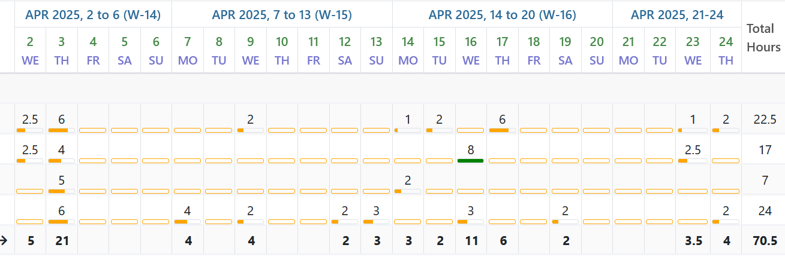
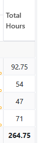
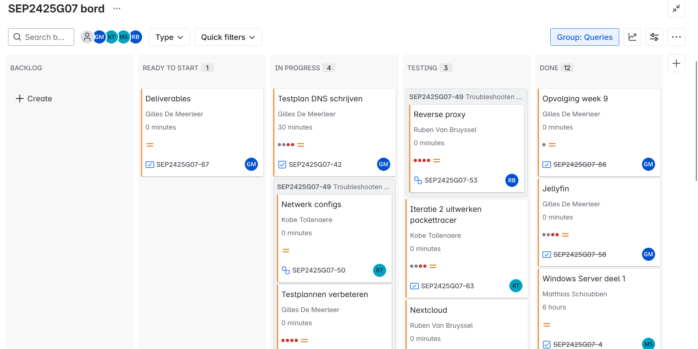
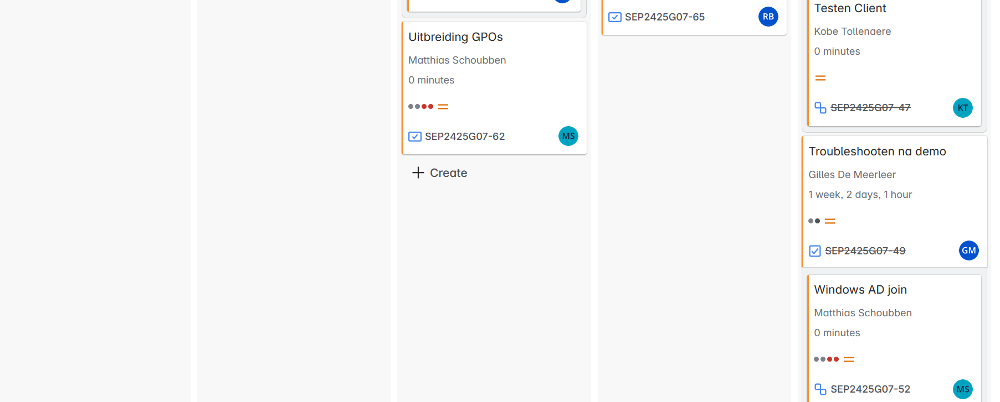
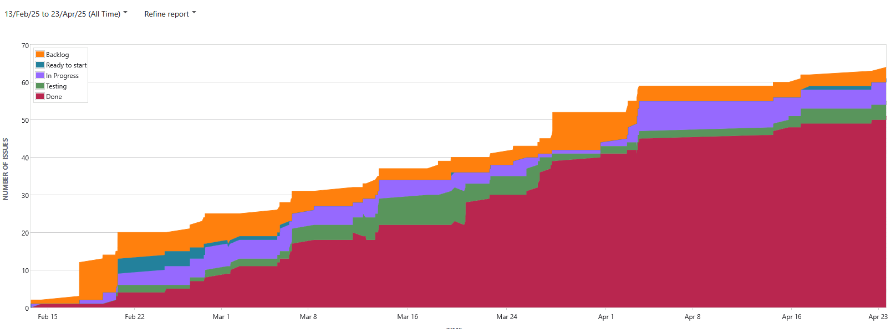
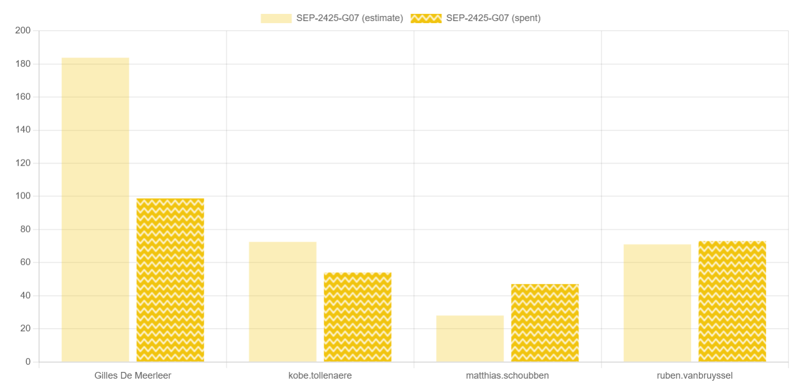

# Deliverables 3 SEP

<!--
  Pas eenmalig dit sjabloon aan met de info van je groep. Daarna kan je wekelijks een kopie maken.

  Indien bepaalde info ook al in JIRA zit, kan je links toevoegen naar de relevante JIRA items ipv hier een copy/paste of screenshot in te voegen.
-->

## Algemeen

- Groep: G07
- Periode: 20 maart 2025 tot 24 april 2025
- JIRA: [Open het bord](https://sep-g07.atlassian.net/jira/software/c/projects/SEP2425G07/boards/2?useStoredSettings=true)

| Student            | Aanw. | Opmerking |
| :----------------- | :---: | :-------- |
| Gilles De Meerleer |  ok   |           |
| Ruben Van Bruyssel |  ok   |           |
| Matthias Schoubben |  ok   |           |
| Kobe Tollenaere    |  ok   |           |

## Wat heb je deze periode gerealiseerd?

### Algemeen

- Plan van aanpak na de teleurstellende demo opgesteld
- Testplannen een beetje aangepast
- Troubleshooting Linux
- Windows trouble shooting
- Jellyfin werkt
- Nextcloud werkt
- Netwerk iteratie 2 is klaar voor test op fysieke machines
- Probleem met Windows GPOs is opgelost
- Uitbreidningen voor windows begonnen
- Reverse proxy aangepast
- Overzicht netwerk gemaakt

### Gilles De Meerleer

<!-- Voeg hier een overzicht toe van gerealiseerde taken inclusief links naar relevante commits/documenten. -->
- Plan van aanpak na de teleurstellende demo opgesteld
- Jellyfin werkt
- Troubleshooting Linux
- Reverse proxy aangepast
- Testplannen een beetje aangepast

### Ruben Van Bruyssel

<!-- Voeg hier een overzicht toe van gerealiseerde taken inclusief links naar relevante commits/documenten. -->
- Nextcloud werkt
- Reverse proxy aangepast

### Matthias Schoubben

<!-- Voeg hier een overzicht toe van gerealiseerde taken inclusief links naar relevante commits/documenten. -->
- Windows trouble shooting
- Probleem met Windows GPOs is opgelost
- Uitbreidningen voor windows begonnen

### Kobe Tollenaere

<!-- Voeg hier een overzicht toe van gerealiseerde taken inclusief links naar relevante commits/documenten. -->
- Netwerk iteratie 2 is klaar voor test op fysieke machines
- Overzicht netwerk gemaakt

## Overzicht JIRA

Tijdstabel (laatste 3 weken):

Totale tijdsbesteding van de groep over de gehele periode
(Gilles, Kobe, Matthias en Ruben, Totaal)

Overzicht van het bord:

Cummulative flow diagram:

Estimate vs actual:

## Wat plan je volgende periode te doen?

### Algemeen

<!-- Voeg hier de doelstellingen toe voor volgende periode. -->

- Nog een paar uitbreidingen voor Windows
- Netwerk iteratie 2 volledig afwerken en testen
- Alles wat we tot nu toe hebben gedaan testen op de fysieke machines
- Documentatie schrijven
- Testplannen schrijven en uitvoeren

### Gilles De Meerleer

<!-- Voeg hier de individuele doelstellingen toe voor volgende periode. -->

- Alles wat we tot nu toe hebben gedaan testen op de fysieke machines
- testplannen schrijven en uitvoeren
- Documentatie schrijven

### Ruben Van Bruyssel

<!-- Voeg hier de individuele doelstellingen toe voor volgende periode. -->

- Demo volledig werkend krijgen op de fysieke apparatuur tijdens de voorbereidende momenten
- testplannen schrijven en uitvoeren
- Documentatie schrijven

### Matthias Schoubben

<!-- Voeg hier de individuele doelstellingen toe voor volgende periode. -->

- Nog een paar uitbreidingen voor Windows
- Documentatie schrijven
- Testplannen schrijven en uitvoeren

### Kobe Tollenaere

<!-- Voeg hier de individuele doelstellingen toe voor volgende periode. -->
- Alles wat we tot nu toe hebben gedaan testen op de fysieke machines
- Netwerk iteratie 2 volledig afwerken en testen
- testplannen schrijven en uitvoeren
- Documentatie schrijven

## Retrospectieve

### Wat doen jullie goed?

<!-- Voeg hier zaken toe die jullie goed doen naar het proces toe. -->

- Onze achterstand van de vorige weken zijn we aan het inhalen
- We zijn goed bezig met de documentatie
- We hebben de samenwerking binnen het team verbeterd

### Waar hebben jullie nog problemen mee?

<!-- Voeg hier zaken toe die volgens jullie beter kunnen naar het proces toe. -->

Ons Jira bord is blijkbaar een beetje verwaarloosd, we zullen hier wat extra moeite in stoppen om dit in orde te krijgen.
