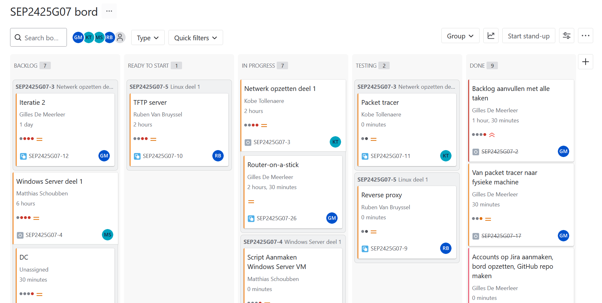
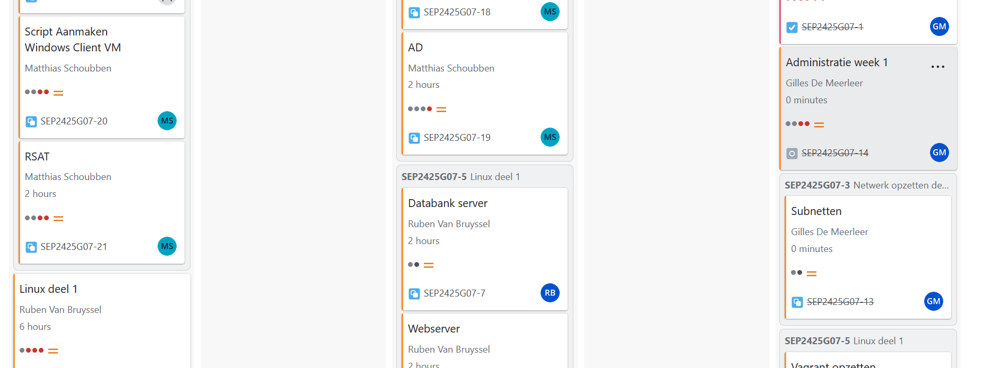
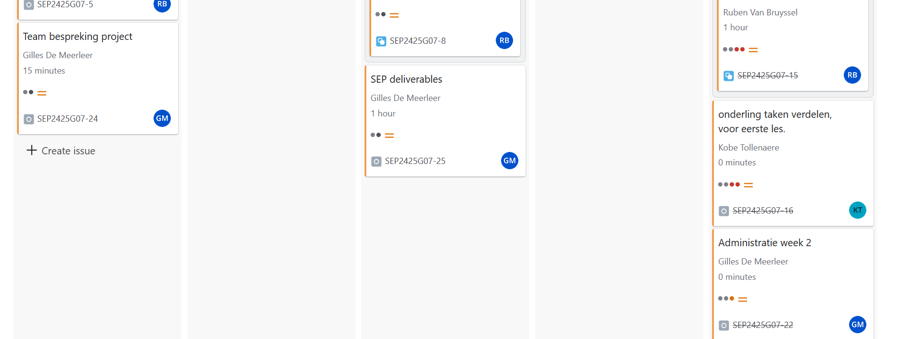
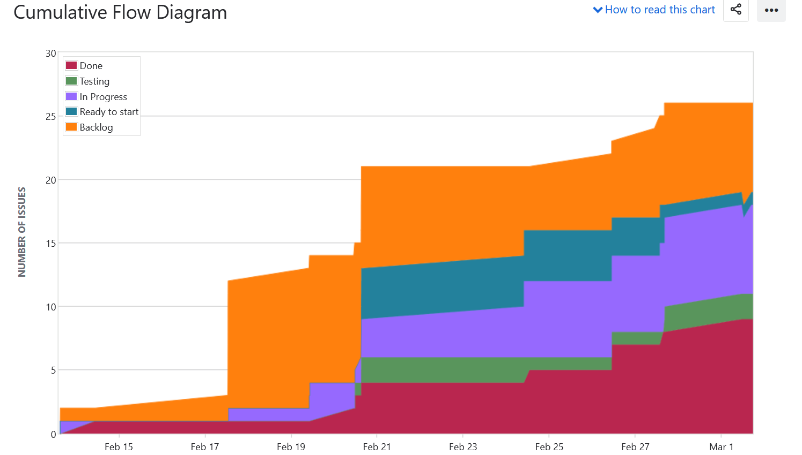
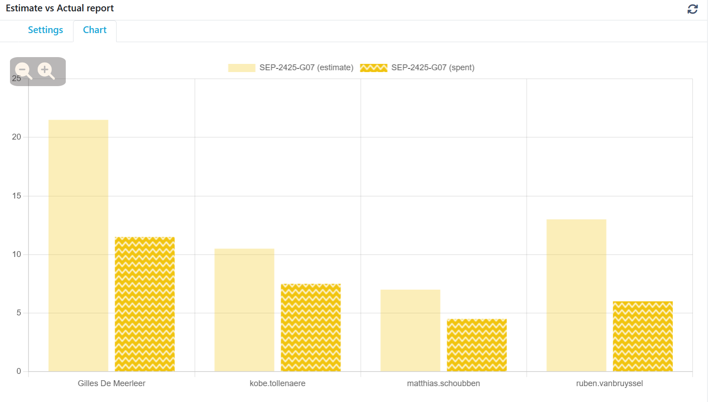

# Opvolgingsrapport <!-- Nummer. -->

<!--
  Pas eenmalig dit sjabloon aan met de info van je groep. Daarna kan je wekelijks een kopie maken.

  Indien bepaalde info ook al in JIRA zit, kan je links toevoegen naar de relevante JIRA items ipv hier een copy/paste of screenshot in te voegen.
-->

## Algemeen

- Groep: G07
- Periode: 20 februari 2025 tot 27 februari 2025
- Datum voortgangsgesprek: 27 februari 2025
- JIRA: [Open het bord](https://sep-g07.atlassian.net/jira/software/c/projects/SEP2425G07/boards/2?useStoredSettings=true)

| Student            | Aanw. | Opmerking |
| :----------------- | :--: | :-------- |
| Gilles De Meerleer |  ok    |           |
| Ruben Van Bruyssel |  ok    |           |
| Matthias Schoubben |  ok    |           |
| Kobe Tollenaere    |  ok    |           |
| Vince Van Hove     |  AFW   | Gaat zich uitschrijven          |

## Wat heb je deze periode gerealiseerd?

### Algemeen

- JIRA site opgezet
- GitHub repository opgezet en aangevuld
- Backlog in grote lijnen opgesteld
- Samengezeten met het team om de taken te doorlopen en te verdelen
- Subnetten uitgewerkt
- Adressentabel opgesteld
- Start van script voor windows voor DC
- AD script windows
- Linux reverse proxy
- Administratie

### Gilles De Meerleer

<!-- Voeg hier een overzicht toe van gerealiseerde taken inclusief links naar relevante commits/documenten. -->

- Subnetten helpen uitwerken
- Administratie

### Ruben Van Bruyssel

<!-- Voeg hier een overzicht toe van gerealiseerde taken inclusief links naar relevante commits/documenten. -->

- Linux reverse proxy

### Matthias Schoubben

<!-- Voeg hier een overzicht toe van gerealiseerde taken inclusief links naar relevante commits/documenten. -->

- Start van script voor windows voor DC
- AD script windows

### Kobe Tollenaere

<!-- Voeg hier een overzicht toe van gerealiseerde taken inclusief links naar relevante commits/documenten. -->

- Subnetten uitgewerkt

### Vince Van Hove

<!-- Voeg hier een overzicht toe van gerealiseerde taken inclusief links naar relevante commits/documenten. -->

- Start van script voor windows voor DC

## Overzicht JIRA

Tijdstabel:

Bord:

Cummulative flow diagram:

Geschatte tijd vs effectieve tijd:

## Wat plan je volgende periode te doen?

### Algemeen

<!-- Voeg hier de doelstellingen toe voor volgende periode. -->

- Volledig uitwerken van het netwerk in packet tracer
- Eerste versie van de Linux services afwerken
- Windows script verder afwerken

### Gilles De Meerleer

<!-- Voeg hier de individuele doelstellingen toe voor volgende periode. -->

- Uitwerken van het netwerk in packet tracer

### Ruben Van Bruyssel

<!-- Voeg hier de individuele doelstellingen toe voor volgende periode. -->

- Verder werken aan Linux services

### Matthias Schoubben

<!-- Voeg hier de individuele doelstellingen toe voor volgende periode. -->

- Windows script verder afwerken

### Kobe Tollenaere

<!-- Voeg hier de individuele doelstellingen toe voor volgende periode. -->

- Uitwerken van het netwerk in packet tracer

### Vince Van Hove

<!-- Voeg hier de individuele doelstellingen toe voor volgende periode. -->

Zal niet meer verder werken aan dit project.

## Retrospectieve

### Wat doen jullie goed?

<!-- Voeg hier zaken toe die jullie goed doen naar het proces toe. -->

- Werken in team
- Goed communiceren en plannen

### Waar hebben jullie nog problemen mee?

<!-- Voeg hier zaken toe die volgens jullie beter kunnen naar het proces toe. -->

- Subnetten verliep een beetje stroef, inmiddels is dit opgelost
- Groepslid: Vince liet gisteren weten dat hij zich ging uitschrijven voor het groepswerk. We weten nog niet goed wat we hiermee moeten doen.
- Niet duidelijk wat mevr De Leenheer verwacht met deliverables

### Feedback

#### Groep

Opvolging door Bert Van Vreckem

- Opvolgingsrapport stond klaar
- JIRA: 24 taken, in verschillende stadia
    - Nog geen "technische" taken in Testing of verder. Problemen?
    - Te weinig uren gelogd. Hou dit beter bij!
- Vince gaat zich uitschrijven, taken worden overgenomen
    - "Moeten we de toegang van Vince tot de repo & JIRA stopzetten?" -> laat nog even zo, maar kunnen we later zeker overwegen.

Progress:

- Netwerk:
    - Router en switch zijn geconfigureerd in PT, nu aan het testen
    - Al op fysieke HW gewerkt? -> Nee
        - Zeker volgende week doen! JE hebt die ervaring nodig om de oplevering vlot te kunnen doen
        - Heb ook aandacht voor de testplannen en -rapporten
    - Config files op GH
- Windows:
    - Enkel .BAT script op GH! Daarna ook PowerShell-script voor AD zien verschijnen
    - Hoe shared folder aanmaken in een VM om scripts meteen uit te voeren? Installate Guest Additions lukt niet?
        - In de VM kan je normaal met `net view` de shared folders van VirtualBox zien (onder \\VBOXSRV\)
        - Controleer ook eens de Shared Folder settings in VirtualBox (en check met de handleiding)
        - Vraag evt ook hulp aan mr. Courtens.
- Linux (bekeken op branch Linux-scripting):
    - Vagrant-omgeving
        - Te veel services op dezelfde VM, gebruik aparte VMs voor bv DB, TFTP. Zo leer je ook services over het netwerk beschikbaar maken voor gebruikers
        - Er was verwarring hierover omdat in het initiële .pkt-bestand dat de begeleiders aangeleverd hadden slechts 2 serversystemen stonden, 1 Windows en 1 Linux
        - Je mag de VMs uit elkaar trekken, zoals je het in een productie-omgeving zou doen.
    - Reverse Proxy: op de verkeerde weg, had deze eigenlijk niet als een reverse proxy geconfigureerd.
    - Daardoor is er vertraging met de andere VMs
        - TFTP nog niet geconfigureerd?
        - DB server: waarom poort 80 doorlaten? Waarom service mysql + poort 3306?
    - Tip: zet gemeenschappelijke config (bv DB naam, credentials) in een aparte file en include die in je scripts
    - Waarom werken op een aparte branch? Je vergroot zo kans op merge-conflicten.
        - Alles zit terug in main, branch mag verwijderd worden

#### Gilles De Meerleer

#### Ruben Van Bruyssel

#### Matthias Schoubben

#### Kobe Tollenaere

#### Vince Van Hove