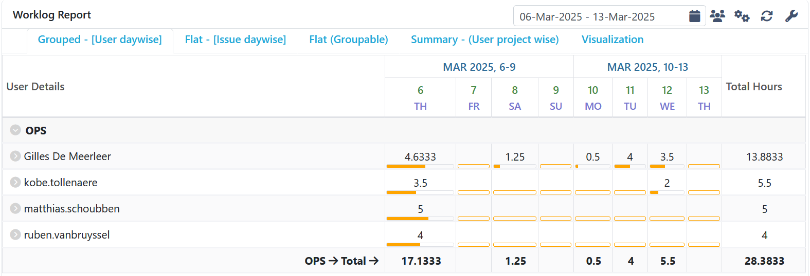

# Opvolgingsrapport 4

<!--
  Pas eenmalig dit sjabloon aan met de info van je groep. Daarna kan je wekelijks een kopie maken.

  Indien bepaalde info ook al in JIRA zit, kan je links toevoegen naar de relevante JIRA items ipv hier een copy/paste of screenshot in te voegen.
-->

## Algemeen

- Groep: G07
- Periode: 6 maart 2025 tot 13 maart 2025
- Datum voortgangsgesprek: 13 maart 2025
- JIRA: [Open het bord](https://sep-g07.atlassian.net/jira/software/c/projects/SEP2425G07/boards/2?useStoredSettings=true)

| Student            | Aanw. | Opmerking |
| :----------------- | :---: | :-------- |
| Gilles De Meerleer |       |           |
| Ruben Van Bruyssel |       |           |
| Matthias Schoubben |       |           |
| Kobe Tollenaere    |       |           |

## Wat heb je deze periode gerealiseerd?

### Algemeen

- Netwerk getest op de fysieke apparatuur
- Overzicht van de netwerkconfiguratie opgesteld
- Gestart met installatie CMS
- TFTP server afgewerkt
- Testplannen geschreven
- Scripts voor windows geschreven

### Gilles De Meerleer

<!-- Voeg hier een overzicht toe van gerealiseerde taken inclusief links naar relevante commits/documenten. -->

- Gestart met installatie CMS
- TFTP server afgewerkt
- Testplannen geschreven
- Netwerk getest op de fysieke apparatuur

### Ruben Van Bruyssel

<!-- Voeg hier een overzicht toe van gerealiseerde taken inclusief links naar relevante commits/documenten. -->
- Gestart met installatie CMS
- TFTP server afgewerkt

### Matthias Schoubben

<!-- Voeg hier een overzicht toe van gerealiseerde taken inclusief links naar relevante commits/documenten. -->

- Scripts voor windows geschreven

### Kobe Tollenaere

<!-- Voeg hier een overzicht toe van gerealiseerde taken inclusief links naar relevante commits/documenten. -->
- Subnetten wat aangepast zodat er meer servers in het netwerk kunnen
- Netwerk getest op de fysieke apparatuur

## Overzicht JIRA

Tijdstabel:

## Wat plan je volgende periode te doen?

### Algemeen

<!-- Voeg hier de doelstellingen toe voor volgende periode. -->

- CMS volledig werkend krijgen
- Windows volledig afwerken
- Reverse proxy opzetten
- Windows client vm aanmaken
- Windows client config script maken
- Beginnen met RSAT
- Documentatie schrijven

### Gilles De Meerleer

<!-- Voeg hier de individuele doelstellingen toe voor volgende periode. -->

- CMS volledig werkend krijgen
- Windows volledig afwerken
- Testplannen schrijven
- Documentatie schrijven

### Ruben Van Bruyssel

<!-- Voeg hier de individuele doelstellingen toe voor volgende periode. -->

- Reverse proxy opzetten
- CMS volledig werkend krijgen
- Testplannen schrijven

### Matthias Schoubben

<!-- Voeg hier de individuele doelstellingen toe voor volgende periode. -->
- Windows client vm aanmaken
- Windows client config script maken

### Kobe Tollenaere

<!-- Voeg hier de individuele doelstellingen toe voor volgende periode. -->

- Beginnen met RSAT
- Kijken of alle config files in orde zijn om te gebruiken
de excel file opkuisen uitbreiden

## Retrospectieve

### Wat doen jullie goed?

<!-- Voeg hier zaken toe die jullie goed doen naar het proces toe. -->

- Netwerk zit op schema
- Linux begint vorm te krijgen

### Waar hebben jullie nog problemen mee?

<!-- Voeg hier zaken toe die volgens jullie beter kunnen naar het proces toe. -->

- Windows loopt nog een beetje traag, we zetten hier extra mensen op.

### Feedback

Opvolging door A. Van Maele:
* slechts 4-5 uur gelogd voor 3 van de 4 ... dat geeft een negatief beeld
* taakverdeling die je afspreekt mag gewoon per persoon uitgewerkt worden, hoeft niet in algemeen herhaald te worden
* drupal werkt nog niet: is php geïnstalleerd, en is php toegelaten op de server?
* windows: zorg dat client en server bij de demo op verschillende laptops klaar staan.
* TFTP issues: pingen wel, maar geen config van de router -> ip tftp source ?
* documentatie: verwijder input of verander documentatie die je importeert: 
  https://github.com/HoGentTIN/sep-24-25-g7/blob/main/src/Vagrant/vagrant-g07/README.md

Algemeen: goede maar net wat trage voortgang. Iets meer uren spenderen lijkt aangewezen de komende 2 weken.

#### Gilles De Meerleer

#### Ruben Van Bruyssel

#### Matthias Schoubben

#### Kobe Tollenaere
