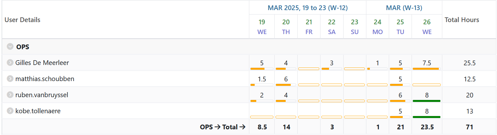

# Opvolgingsrapport 6

<!--
  Pas eenmalig dit sjabloon aan met de info van je groep. Daarna kan je wekelijks een kopie maken.

  Indien bepaalde info ook al in JIRA zit, kan je links toevoegen naar de relevante JIRA items ipv hier een copy/paste of screenshot in te voegen.
-->

## Algemeen

- Groep: G07
- Periode: 20 maart 2025 tot 27 maart 2025
- Datum voortgangsgesprek: 27 maart 2025
- JIRA: [Open het bord](https://sep-g07.atlassian.net/jira/software/c/projects/SEP2425G07/boards/2?useStoredSettings=true)

| Student            | Aanw. | Opmerking |
| :----------------- | :---: | :-------- |
| Gilles De Meerleer |       |           |
| Ruben Van Bruyssel |       |           |
| Matthias Schoubben |       |           |
| Kobe Tollenaere    |       |           |

## Wat heb je deze periode gerealiseerd?

### Algemeen

- Alles getest op de apparatuur
- Troubleshooting gedaan
- Voorbereiding demo
- Opvolgingsrapport 6 geschreven

### Gilles De Meerleer

<!-- Voeg hier een overzicht toe van gerealiseerde taken inclusief links naar relevante commits/documenten. -->

- Alles getest op de apparatuur
- Troubleshooting gedaan
- Voorbereiding demo
- Opvolgingsrapport 6 geschreven

### Ruben Van Bruyssel

<!-- Voeg hier een overzicht toe van gerealiseerde taken inclusief links naar relevante commits/documenten. -->

- Alles getest op de apparatuur
- Troubleshooting gedaan
- Voorbereiding demo

### Matthias Schoubben

<!-- Voeg hier een overzicht toe van gerealiseerde taken inclusief links naar relevante commits/documenten. -->

- Alles getest op de apparatuur
- Troubleshooting gedaan
- Voorbereiding demo

### Kobe Tollenaere

<!-- Voeg hier een overzicht toe van gerealiseerde taken inclusief links naar relevante commits/documenten. -->

- Alles getest op de apparatuur
- Troubleshooting gedaan
- Voorbereiding demo

## Overzicht JIRA

Tijdstabel:

## Wat plan je volgende periode te doen?

### Algemeen

<!-- Voeg hier de doelstellingen toe voor volgende periode. -->

- Iteratie 2 starten

Individuele taakverdeling wordt nog besproken.

## Retrospectieve

### Wat doen jullie goed?

<!-- Voeg hier zaken toe die jullie goed doen naar het proces toe. -->

- Netwerk werkt volledig
- Linux servers werken, reverse proxy werkt nog niet
- Windows serever werkt ook op een klein prbleem na met een domain join

### Waar hebben jullie nog problemen mee?

<!-- Voeg hier zaken toe die volgens jullie beter kunnen naar het proces toe. -->

Wat vertraging opgelopen door de problemen met de TFTP, hierdoor zijn er nog wat foutjes in de configuratie van de windows servers en de reverse proxy.

### Feedback

Opvolging door : 

#### Groep

#### Gilles De Meerleer

#### Ruben Van Bruyssel

#### Matthias Schoubben

#### Kobe Tollenaere
