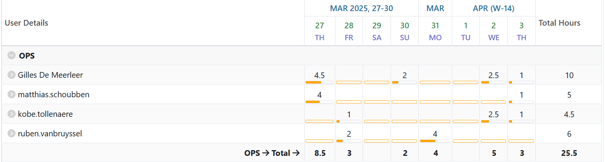
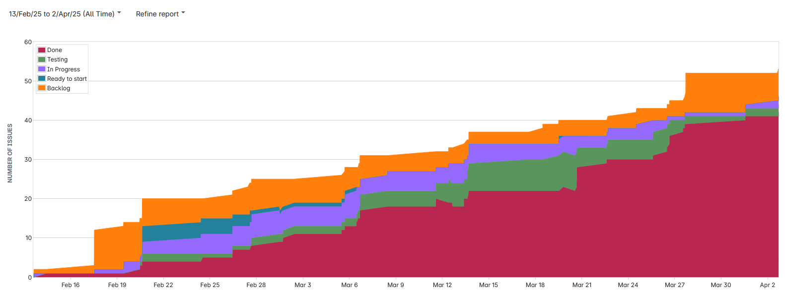

# Opvolgingsrapport 7

<!--
  Pas eenmalig dit sjabloon aan met de info van je groep. Daarna kan je wekelijks een kopie maken.

  Indien bepaalde info ook al in JIRA zit, kan je links toevoegen naar de relevante JIRA items ipv hier een copy/paste of screenshot in te voegen.
-->

## Algemeen

- Groep: G07
- Periode: 27 maart 2025 tot 3 april 2025
- Datum voortgangsgesprek: 3 april 2025
- JIRA: [Open het bord](https://sep-g07.atlassian.net/jira/software/c/projects/SEP2425G07/boards/2?useStoredSettings=true)

| Student            | Aanw. | Opmerking |
| :----------------- | :---: | :-------- |
| Gilles De Meerleer |       |           |
| Ruben Van Bruyssel |       |           |
| Matthias Schoubben |       |           |
| Kobe Tollenaere    |       |           |

## Wat heb je deze periode gerealiseerd?

### Algemeen

- Plan van aanpak na de demo
- Reverse proxy werkt al, maar nog niet volledig
- Gestart met iteratie 2 van het netwerk
- Testplannen een beetje aangepast
- Troubleshooting Linux
- Opvolging
- Windows trouble shooting

### Gilles De Meerleer

<!-- Voeg hier een overzicht toe van gerealiseerde taken inclusief links naar relevante commits/documenten. -->

- Plan van aanpak na de demo
- Troubleshooting Linux
- Testplannen een beetje aangepast
- Opvolging

### Ruben Van Bruyssel

<!-- Voeg hier een overzicht toe van gerealiseerde taken inclusief links naar relevante commits/documenten. -->

- Reverse proxy werkt al, maar nog niet volledig
- Troubleshooting Linux

### Matthias Schoubben

<!-- Voeg hier een overzicht toe van gerealiseerde taken inclusief links naar relevante commits/documenten. -->

- Plan van aanpak na de demo
- Windows trouble shooting

### Kobe Tollenaere

<!-- Voeg hier een overzicht toe van gerealiseerde taken inclusief links naar relevante commits/documenten. -->

- Gestart met iteratie 2 van het netwerk

## Overzicht JIRA

Tijdstabel:

Cummulatieve flow:

## Wat plan je volgende periode te doen?

### Algemeen

<!-- Voeg hier de doelstellingen toe voor volgende periode. -->

- Iteratie 2 verder afwerken
- Alles van basis volledig afwerken
- Testplannen verder afwerken
- Al eens kijken naar een paar uitbreidingen

Individuele taakverdeling wordt nog besproken.

## Retrospectieve

### Wat doen jullie goed?

<!-- Voeg hier zaken toe die jullie goed doen naar het proces toe. -->

### Waar hebben jullie nog problemen mee?

<!-- Voeg hier zaken toe die volgens jullie beter kunnen naar het proces toe. -->

Na een tegenvallende demo van vorige week, hebben we besloten om ons wat te herpakken en gaan we tijdens de paasvakantie een extra inspanning doen om alles af te krijgen.

### Feedback

Opvolging door : 

#### Groep

#### Gilles De Meerleer

#### Ruben Van Bruyssel

#### Matthias Schoubben

#### Kobe Tollenaere
