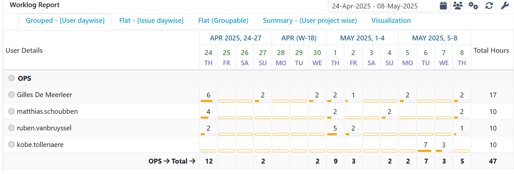
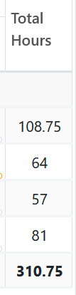
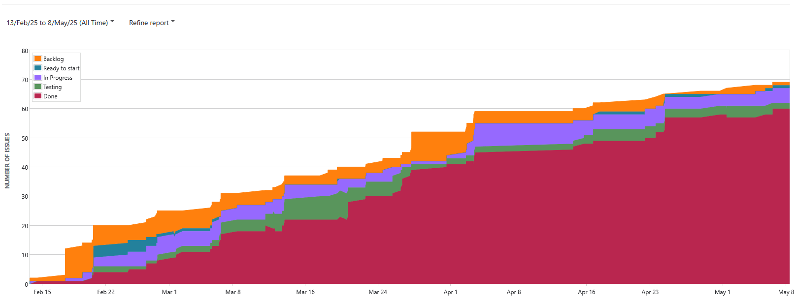

# Opvolgingsrapport 9

<!--
  Pas eenmalig dit sjabloon aan met de info van je groep. Daarna kan je wekelijks een kopie maken.

  Indien bepaalde info ook al in JIRA zit, kan je links toevoegen naar de relevante JIRA items ipv hier een copy/paste of screenshot in te voegen.
-->

## Algemeen

- Groep: G07
- Periode: 24 april 2025 tot 8 mei 2025
- Datum voortgangsgesprek: 8 mei 2025
- JIRA: [Open het bord](https://sep-g07.atlassian.net/jira/software/c/projects/SEP2425G07/boards/2?useStoredSettings=true)

| Student            | Aanw. | Opmerking |
| :----------------- | :---: | :-------- |
| Gilles De Meerleer |       |           |
| Ruben Van Bruyssel |       |           |
| Matthias Schoubben |       |           |
| Kobe Tollenaere    |       |           |

## Wat heb je deze periode gerealiseerd?

### Algemeen

- Jellyfin verbeterd
- Nextcloud verbeterd
- Nextcloud en jellyfin met reverse proxy bereikbaar gemaakt
- Redundante router ingesteld
- Redundante Windows server
- Uitbreidingen GPO's
- Opvolging
- Deliverables

### Gilles De Meerleer

<!-- Voeg hier een overzicht toe van gerealiseerde taken inclusief links naar relevante commits/documenten. -->

- Jellyfin verbeterd
- Opvolging
- Deliverables
- Testplannen geschreven

### Ruben Van Bruyssel

<!-- Voeg hier een overzicht toe van gerealiseerde taken inclusief links naar relevante commits/documenten. -->

- Nextcloud verbeterd
- Nextcloud en jellyfin met reverse proxy bereikbaar gemaakt

### Matthias Schoubben

<!-- Voeg hier een overzicht toe van gerealiseerde taken inclusief links naar relevante commits/documenten. -->

- Redundante Windows server
- Uitbreidingen GPO's
- Testplannen geschreven

### Kobe Tollenaere

<!-- Voeg hier een overzicht toe van gerealiseerde taken inclusief links naar relevante commits/documenten. -->

- Redundante router ingesteld
- Overzicht adressen gemaakt

## Overzicht JIRA

Tijdstabel:

Totaal aantal uren:

Cummulatieve flow:

## Wat plan je volgende periode te doen?

### Algemeen

<!-- Voeg hier de doelstellingen toe voor volgende periode. -->

- Alles testen voor de demo
- Testplannen, testrapporten en draaiboek afwerken voor de demo
- Raspberry pi in orde gebracht
- Problemen met vagranten opgelost
- Lastenboek gemaakt

## Retrospectieve

### Wat doen jullie goed?

<!-- Voeg hier zaken toe die jullie goed doen naar het proces toe. -->
Alle uitbreidingen die we wilden doen zijn nu gedaan.

### Waar hebben jullie nog problemen mee?

<!-- Voeg hier zaken toe die volgens jullie beter kunnen naar het proces toe. -->

### Feedback

#### Groep

#### Gilles De Meerleer

#### Ruben Van Bruyssel

#### Matthias Schoubben

#### Kobe Tollenaere
